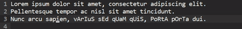

# Manipulator Plugin

This is an simple plugin to extend text manipulation in Micro.

## Keybindings
By default no keybindings exist, but you can easily modify that
in your `bindings.json` file:

```json
{
    "Ctrl-L": "manipulator.lower"
}
```

You can also execute a command which will do the same thing as
the binding:

```
> lower
```

If you have a selection, the plugin will change all of the
selection.

The following commands currently exists:
 * `upper`: UPPERCASE
 * `lower`: lowercase
 * `reverse`: Reverses
 * `base64enc`: Base64 encodes
 * `base64dec`: Base64 decodes
 * `rot13`: ROT-13
 * `incNum`: Increase number by one
 * `decNum`: Decrease number by one
 * `capital`: Capitalize First Letter
 * `brace`: Adds brackets around selection 
     * `curly`: Curly brackets (`{ }`)
     * `square`: Square brackets (`[ ]`)
	 * `angle`: Angle brackets (`< >`)
     * `dquote`: Double quotes (`" "`)
     * `squote`: Single quotes (`' '`)

## Issues

Please use the issue tracker if you have any issues or
feature requests!


## Demo


